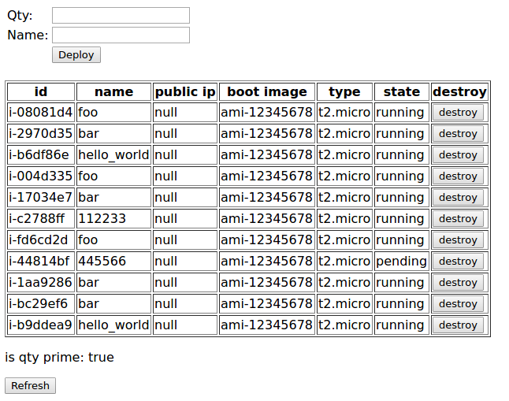

aws-interface
=========

## Overview ##
This project is a solution to a puzzle for interfacing AWS from justdigitalpeople.

## Quick Start - How to run 2 modes in Docker container ##
- Mode 1. Run the webapp in container:
```
sudo docker pull jameronline/aws-interface
sudo docker run -dit -p 8081:8080 --name=my-aws-interface jameronline/aws-interface /bin/bash
sudo docker exec -it my-aws-interface /bin/bash
/bin/bash /home/gradle/run-all.sh
```
Wait a few seconds (up to 3 mins as there is a process to download dependency jar files from maven repo) and in your browser access http://localhost:8081/aws-interface

A screenshot of the ugly demo page:


- Mode 2. Run tests in container:
```
sudo docker pull jameronline/aws-interface
sudo docker run jameronline/aws-interface /bin/bash /home/gradle/run-test.sh
```

## Setup prerequisites (Linux) ##
On Ubuntu 16.04 LTS or equivalent and have the following in your PATH:
- GNU Make 4.1+
- JDK 1.8+
- Gradle 3.x
- npm 3.0+

## How to run locally ##
The free and easist way to run aws-interface without configuration is to run it with [aws-mock](https://github.com/treelogic-swe/aws-mock), which is our open-source mock of Amazon Web Services for testing purposes from treelogic-swe.com in which I involved a lot.
- First let's start aws-mock in a console:
```
git clone https://github.com/treelogic-swe/aws-mock.git
cd aws-mock
gradle jettyRun
```
- Then open another console and run this aws-interface:
```
git clone https://github.com/maxiaohao/aws-interface.git
cd aws-interface
make
make run
```
- Now you can open your browser at http://localhost:8080/aws-interface and verify the solution to the puzzle.

- If you'd like to try with genuine AWS rather than aws-mock, just configure the AWS endpoint and region in `src/main/resources/aws-conf.properties` and put your AWS credentials into `src/main/resources/aws-credentials.properties` and run `make && make run` again.


## To run the test ##
- Run `make test`, though there is only a little code covered for now.

## To develop in eclipse ##
- Run `make init-eclipse` and import this project into your eclipse workspace.

## TODO ##
- Enrich the test coverage

